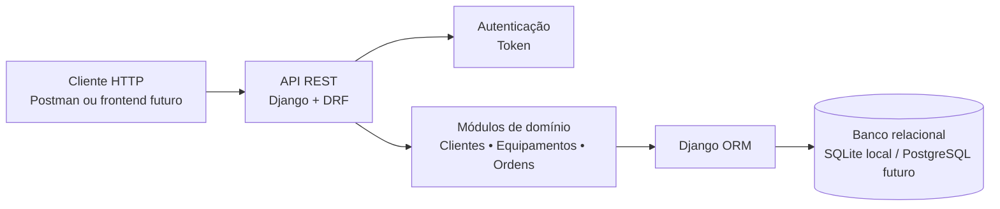
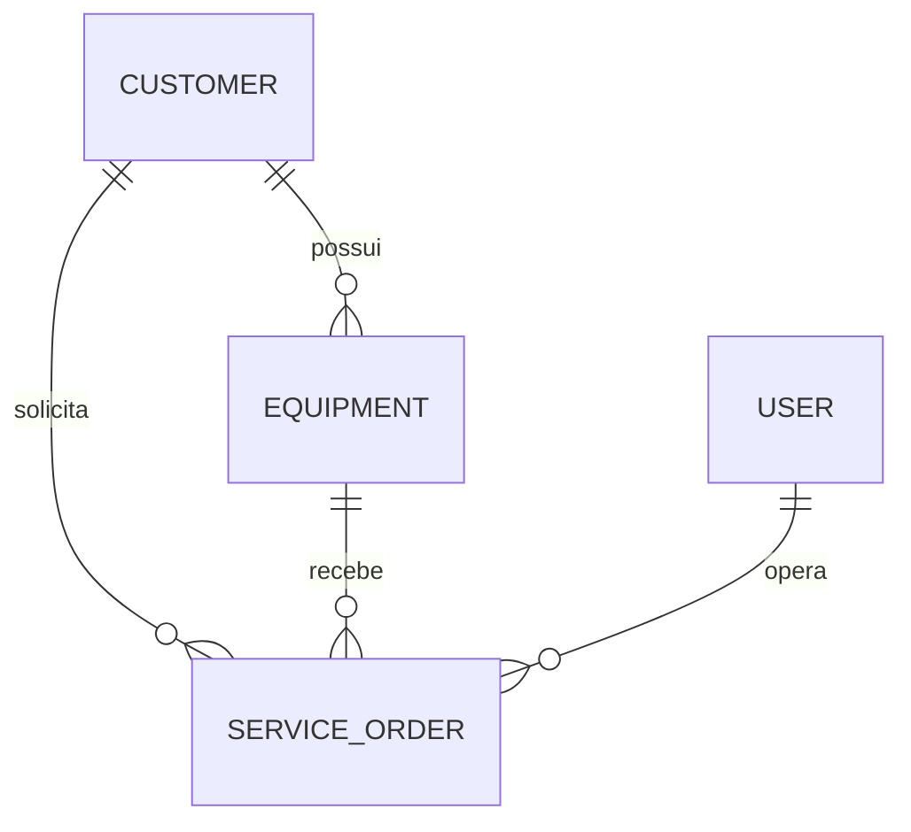
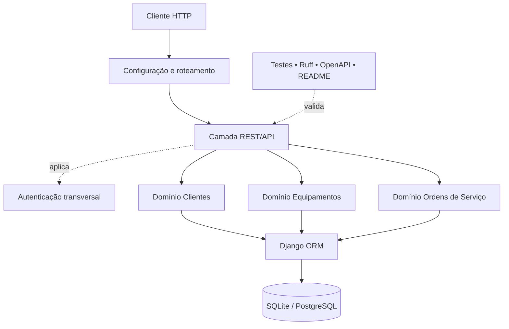
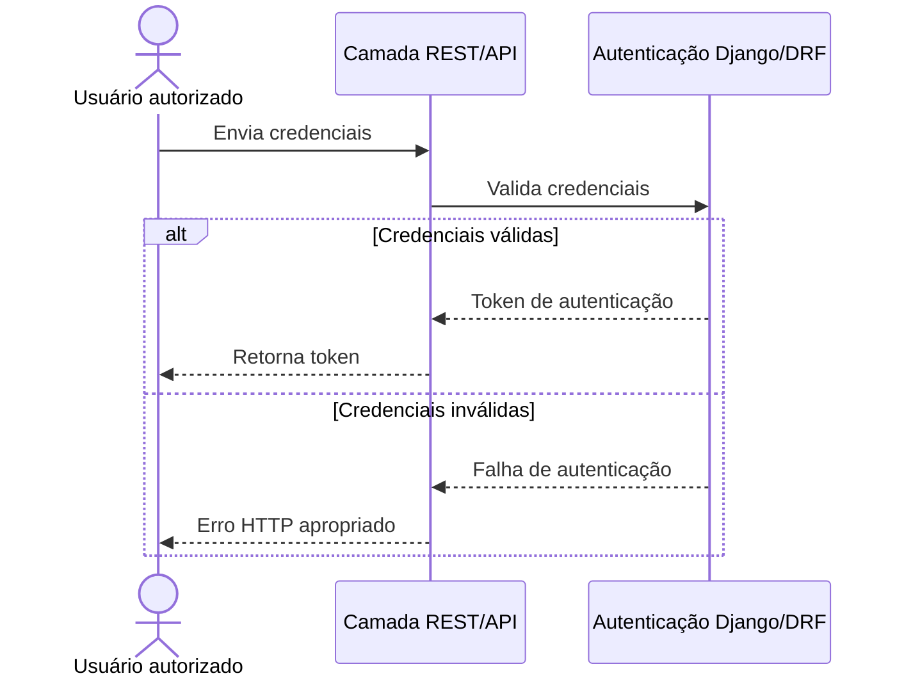
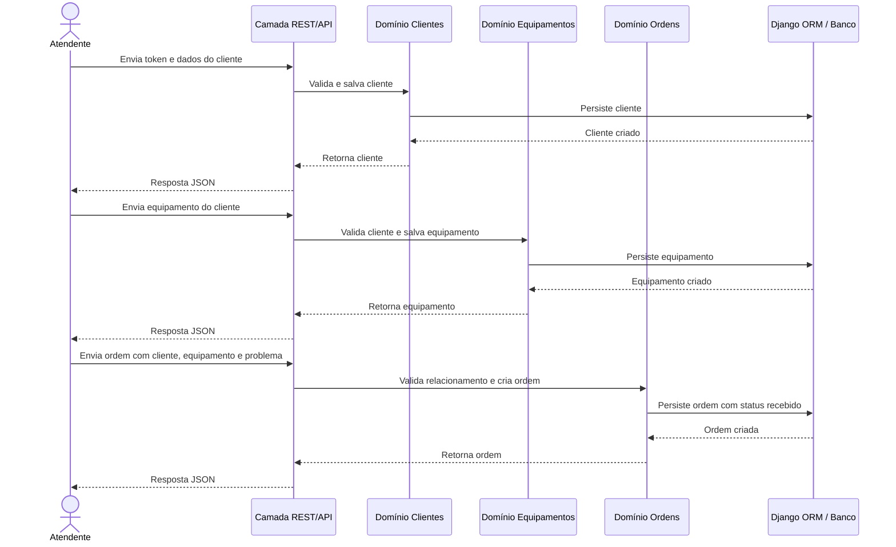
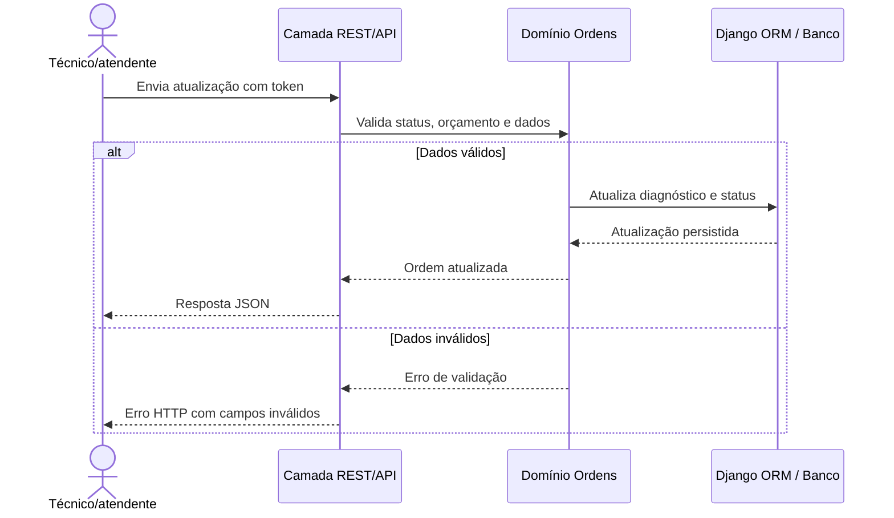

# TechService API — Documento de Arquitetura

> Status: Aprovado com ressalvas  
> Versão: 1.8  
> Data: 22/08/2026  
> Tipo de sistema: Backend/API REST  
> Documento de origem: [docs/prd.md](./prd.md), versão 0.7

## Introdução

Este documento descreve a arquitetura da TechService API, uma API REST para organizar clientes, equipamentos e ordens de serviço de uma pequena assistência técnica. A arquitetura será usada como guia para desenvolvimento humano e por agentes de IA, mantendo o sistema simples, testável e adequado ao escopo júnior definido no PRD.

O projeto é exclusivamente backend nesta primeira versão. Não haverá frontend, aplicativo mobile ou arquitetura separada de interface. Uma eventual interface futura deverá consumir os contratos REST definidos neste documento sem alterar o núcleo do domínio.

### Starter template ou projeto existente

O PRD não menciona starter template, boilerplate ou código existente. O projeto é greenfield e contém apenas documentação inicial.

#### Opção recomendada: projeto Django/DRF criado do zero

> Status da decisão: Aprovado

Para este portfólio, a recomendação é iniciar com a estrutura padrão do Django e adicionar o Django REST Framework de forma explícita, sem Cookiecutter Django ou boilerplate completo.

**Motivos:**

- Maximiza o aprendizado do desenvolvedor júnior sobre Django e DRF.
- Mantém poucas dependências e decisões escondidas.
- Facilita explicar a estrutura em entrevistas e propostas freelancer.
- Evita trazer Docker, filas, múltiplas aplicações e configurações que estão fora do MVP.

**Custo assumido:** a configuração inicial de ambiente, testes e documentação será feita manualmente conforme as stories do Épico 1.

### Histórico de alterações

| Data | Versão | Descrição | Autor |
|---|---:|---|---|
| 22/08/2026 | 0.1 | Criação do rascunho inicial da arquitetura com base no PRD | Aria (Architect) |
| 22/08/2026 | 0.2 | Aprovação do starter template e inclusão da arquitetura de alto nível | Aria (Architect) |
| 22/08/2026 | 0.3 | Inclusão da proposta de Tech Stack com versões verificadas | Aria (Architect) |
| 22/08/2026 | 0.4 | Aprovação do Tech Stack e inclusão dos modelos conceituais | Aria (Architect) |
| 22/08/2026 | 0.5 | Aprovação dos modelos e inclusão dos componentes da aplicação | Aria (Architect) |
| 22/08/2026 | 0.6 | Aplicação da revisão dos componentes e inclusão dos fluxos principais | Aria (Architect) |
| 22/08/2026 | 0.7 | Aprovação dos fluxos e inclusão da especificação REST/OpenAPI | Aria (Architect) |
| 22/08/2026 | 0.8 | Aprovação da especificação REST/OpenAPI e inclusão do schema relacional inicial | Aria (Architect) |
| 22/08/2026 | 0.9 | Aprovação do schema relacional e inclusão da estrutura de pastas | Aria (Architect) |
| 22/08/2026 | 1.0 | Aprovação da estrutura de pastas e inclusão da estratégia de infraestrutura e deploy | Aria (Architect) |
| 22/08/2026 | 1.1 | Aprovação da infraestrutura e inclusão da estratégia de tratamento de erros | Aria (Architect) |
| 22/08/2026 | 1.2 | Aprovação do tratamento de erros e inclusão dos padrões de código | Aria (Architect) |
| 22/08/2026 | 1.3 | Aprovação dos padrões de código e inclusão da estratégia de testes | Aria (Architect) |
| 22/08/2026 | 1.4 | Aprovação da estratégia de testes e inclusão dos requisitos de segurança | Aria (Architect) |
| 22/08/2026 | 1.5 | Aprovação dos requisitos de segurança e preparação da revisão final | Aria (Architect) |
| 22/08/2026 | 1.6 | Consolidação dos status aprovados da arquitetura de alto nível e do Tech Stack | Aria (Architect) |
| 22/08/2026 | 1.7 | Execução do checklist do Architect e registro das ressalvas para implementação | Aria (Architect) |
| 22/08/2026 | 1.8 | Inclusão do endpoint público de health check no contrato OpenAPI | Aria (Architect) |

## Arquitetura de alto nível

> Status: Aprovado

### Resumo técnico

A TechService API utilizará um monólito modular desenvolvido com Django e Django REST Framework. A aplicação será organizada por domínios de negócio, com autenticação, clientes, equipamentos e ordens de serviço separados em módulos simples dentro do mesmo projeto. O Django ORM fará o acesso ao banco relacional, usando SQLite localmente e deixando PostgreSQL como opção para um deploy futuro. A API REST será a única porta de entrada do MVP, sem frontend, filas, microsserviços ou integrações externas.

### Visão geral

- **Estilo arquitetural:** Monólito modular.
- **Repositório:** Um único repositório para a API.
- **Implantação:** Uma aplicação Django executável como um único serviço.
- **Entrada do sistema:** Clientes HTTP, como Postman, Insomnia ou um futuro frontend.
- **Autenticação:** Token da API protege os recursos de negócio.
- **Domínios principais:** Usuários, clientes, equipamentos e ordens de serviço.
- **Persistência:** Django ORM sobre SQLite no desenvolvimento e PostgreSQL em eventual deploy.
- **Integrações externas:** Nenhuma no MVP.

### Fluxo conceitual de dados



### Padrões arquiteturais e de design

#### 1. Monólito modular

- **Opção A — Monólito modular:** uma aplicação e um deploy, com módulos separados por domínio.
- **Opção B — Microsserviços:** serviços independentes para clientes, equipamentos e ordens.
- **Recomendação:** Monólito modular.
- **Rationale:** atende ao MVP, reduz infraestrutura e mantém o projeto compreensível para um desenvolvedor júnior. Microsserviços adicionariam rede, deploy e observabilidade sem benefício real neste escopo.

#### 2. API REST

- **Opção A — REST:** endpoints HTTP com JSON e códigos de status.
- **Opção B — GraphQL:** um endpoint com consultas flexíveis.
- **Recomendação:** REST.
- **Rationale:** está definido no PRD, é mais simples de testar com Postman e é uma tecnologia comum em freelas Django/DRF.

#### 3. Organização por domínio Django

- **Opção A — Apps separados por domínio:** `clientes`, `equipamentos` e `ordens_servico`.
- **Opção B — Uma única app com todos os modelos e endpoints.**
- **Recomendação:** Apps separados por domínio, sem criar camadas artificiais.
- **Rationale:** mantém responsabilidades claras e facilita evolução, mas continua simples o suficiente para o tamanho do projeto.

#### 4. Acesso a dados e regras de negócio

- **Opção A — Django ORM diretamente nas views e serializers.**
- **Opção B — Repository Pattern e camada de serviços completa.**
- **Recomendação:** Django ORM com uma camada leve de serviços apenas quando uma regra envolver múltiplas operações.
- **Rationale:** evita abstrações desnecessárias. O Repository Pattern e uma camada complexa seriam overengineering para três entidades principais.

#### 5. Comunicação interna

- **Opção A — Chamadas síncronas dentro do monólito.**
- **Opção B — Eventos, filas e processamento assíncrono.**
- **Recomendação:** Chamadas síncronas.
- **Rationale:** o MVP não possui notificações, integrações ou tarefas longas que justifiquem Celery, Redis ou mensageria.

## Tech Stack

> Status: Aprovado

### Infraestrutura de nuvem

- **Provedor:** Nenhum no MVP inicial.
- **Serviços principais:** Execução local, SQLite e documentação no README.
- **Região de deploy:** Não aplicável nesta fase.
- **Decisão futura:** Um provedor simples poderá ser escolhido depois que a API estiver testada e documentada. A escolha não faz parte da implementação inicial.

### Tabela de tecnologias

| Categoria | Tecnologia | Versão | Finalidade | Rationale |
|---|---|---:|---|---|
| Linguagem | Python | 3.13.15 | Linguagem principal | Versão de manutenção estável e boa compatibilidade com o ecossistema Django/DRF escolhido. |
| Framework web | Django | 5.2.17 | Base do monólito web | Versão LTS, adequada para um projeto júnior e com suporte de longo prazo. |
| Framework de API | Django REST Framework | 3.16.1 | Endpoints REST, serializers e autenticação | Integração natural com Django e cobertura suficiente para o MVP. |
| Banco local | SQLite | Incluso no ambiente Python/Django | Persistência durante desenvolvimento | Zero configuração e suficiente para o portfólio inicial. |
| Banco futuro | PostgreSQL | A definir no deploy | Persistência para eventual produção | Só será introduzido quando houver necessidade real de deploy. |
| Documentação da API | drf-spectacular | 0.30.0 | Geração de documentação OpenAPI | Atende ao requisito de documentação sem criar uma ferramenta própria. |
| Testes | Django Test Runner + `APITestCase` | Compatível com Django 5.2.17 e DRF 3.16.1 | Testes unitários e de API | Evita adicionar pytest antes de ser necessário e mantém o aprendizado focado no framework. |
| Qualidade | Ruff | 0.16.2 | Lint e formatação Python | Ferramenta única para reduzir configuração e manter feedback rápido. |
| Ambiente | `venv` + `pip` + `requirements.txt` | Compatível com Python 3.13.15 | Isolamento e instalação de dependências | Mais simples de explicar e usar do que adicionar Poetry ou outro gerenciador neste MVP. |

### Alternativas consideradas

#### Runtime e framework

- **Python 3.14 + Django 6.0:** stack mais nova, mas com maior risco de compatibilidade de bibliotecas para um projeto de aprendizado.
- **Python 3.13.15 + Django 5.2.17 LTS:** recomendada por equilibrar estabilidade, suporte e simplicidade.
- **Python 3.12 + Django 5.2.17:** alternativa conservadora, mas sem necessidade de recuar tanto no runtime.

#### Autenticação

- **TokenAuthentication da DRF:** recomendada; simples e suficiente para o MVP.
- **JWT com SimpleJWT:** útil para cenários com frontend separado, mas adiciona configuração que não é necessária agora.
- **Sessão do Django:** boa para aplicações HTML renderizadas pelo Django, mas menos adequada para uma API consumida por clientes externos.

#### Testes

- **Django Test Runner + `APITestCase`:** recomendado para manter poucas dependências.
- **pytest + pytest-django:** excelente alternativa futura, mas não é necessária para a primeira versão.
- **Testes end-to-end:** adiados; o MVP será validado com testes unitários e de API.

### Fontes consultadas para versões

- [Python 3.13.15](https://www.python.org/downloads/release/python-31315/)
- [Versões suportadas do Django](https://www.djangoproject.com/download/)
- [Django REST Framework 3.16](https://www.django-rest-framework.org/community/3.16-announcement/)
- [drf-spectacular 0.30.0](https://pypi.org/project/drf-spectacular/)
- [Ruff](https://pypi.org/project/ruff/)

## Modelos de dados

> Status: Aprovado  
> Escopo: Modelo conceitual; detalhes de schema e índices ficam para a implementação ou revisão do `@data-engineer`.

### Usuário

**Propósito:** Representar o usuário autorizado que acessa a API.

**Atributos principais:**

- `id`: identificador interno.
- `username`: identificador de acesso do usuário Django.
- `password`: senha armazenada pelo mecanismo seguro do Django, nunca em texto puro.
- `is_active`: indica se o acesso está ativo.

**Relacionamentos:**

- Pode autenticar-se e operar os recursos protegidos da API.
- O MVP não terá matriz avançada de papéis ou permissões.

### Cliente

**Propósito:** Representar a pessoa que solicita o conserto.

**Atributos principais:**

- `id`: identificador do cliente.
- `name`: nome obrigatório.
- `phone`: telefone obrigatório.
- `email`: e-mail opcional e validado quando informado.
- `created_at`: data de criação.
- `updated_at`: data da última atualização.

**Relacionamentos:**

- Possui um ou vários equipamentos.
- Possui uma ou várias ordens de serviço.

### Equipamento

**Propósito:** Representar o aparelho ou equipamento levado à assistência.

**Atributos principais:**

- `id`: identificador do equipamento.
- `customer_id`: referência obrigatória ao cliente proprietário.
- `type`: tipo do equipamento, como celular, computador ou impressora.
- `brand`: marca do equipamento.
- `model`: modelo do equipamento.
- `identifier`: número de série ou outro identificador opcional.
- `created_at`: data de criação.
- `updated_at`: data da última atualização.

**Relacionamentos:**

- Pertence a exatamente um cliente.
- Pode aparecer em várias ordens de serviço ao longo do tempo.

### Ordem de serviço

**Propósito:** Representar um atendimento de conserto e seu andamento.

**Atributos principais:**

- `id`: identificador da ordem.
- `customer_id`: referência obrigatória ao cliente.
- `equipment_id`: referência obrigatória ao equipamento.
- `problem_description`: descrição obrigatória do problema relatado.
- `status`: recebido, em diagnóstico, aguardando aprovação, em conserto, pronto, entregue ou cancelado.
- `diagnosis`: diagnóstico opcional durante o atendimento.
- `estimated_budget`: orçamento estimado opcional e não negativo.
- `notes`: observações opcionais do conserto.
- `created_at`: data de abertura.
- `updated_at`: data da última atualização.

**Relacionamentos:**

- Pertence a um cliente e referencia um equipamento.
- O equipamento referenciado deve pertencer ao mesmo cliente informado na ordem.

### Relacionamentos conceituais



### Decisão sobre cliente e equipamento na ordem

O PRD exige que a ordem mantenha referências explícitas ao cliente e ao equipamento. Isso facilita consultas e atende diretamente às stories, mas exige uma validação para garantir que o equipamento realmente pertença ao cliente informado. Essa regra deve ser aplicada na camada de validação da API antes da gravação.

## Componentes

> Status: Aprovado

Os componentes abaixo são módulos lógicos dentro do mesmo projeto Django. Eles não representam microsserviços separados.

### Configuração do projeto

**Responsabilidade:** Centralizar configurações do Django, URLs principais, carregamento de ambiente e configuração dos aplicativos instalados.

**Interfaces principais:**

- Roteamento principal da API.
- Configuração de autenticação, banco e documentação.

**Dependências:** Django, Django REST Framework e variáveis de ambiente.

**Tecnologia:** Projeto Django principal.

### Camada REST/API

**Responsabilidade:** Receber requisições HTTP, aplicar autenticação e validação de entrada, encaminhar operações para os módulos de domínio e devolver respostas JSON consistentes.

**Interfaces principais:**

- URLs e endpoints REST.
- Serializers, validações e respostas HTTP.
- Documentação OpenAPI.

**Dependências:** Configuração do projeto, autenticação, módulos de domínio e persistência.

**Tecnologia:** Django REST Framework.

### Autenticação — preocupação transversal

**Responsabilidade:** Autenticar usuários e proteger os endpoints de negócio.

**Interfaces principais:**

- Endpoint de obtenção de token.
- Permissões de acesso para endpoints protegidos.

**Dependências:** Usuário padrão do Django e autenticação da DRF.

**Tecnologia:** Django Auth e DRF TokenAuthentication aplicados pela camada REST.

### Clientes

**Responsabilidade:** Cadastrar, consultar, listar e atualizar clientes.

**Interfaces principais:**

- Endpoints REST de clientes.
- Serializers e validações de dados de contato.

**Dependências:** Autenticação e camada de persistência do Django ORM.

**Tecnologia:** App Django de domínio de clientes.

### Equipamentos

**Responsabilidade:** Cadastrar, consultar, listar e atualizar equipamentos vinculados a clientes.

**Interfaces principais:**

- Endpoints REST de equipamentos.
- Validação da existência do cliente relacionado.

**Dependências:** Clientes, autenticação e Django ORM.

**Tecnologia:** App Django de domínio de equipamentos.

### Ordens de serviço

**Responsabilidade:** Criar, consultar, atualizar, filtrar e encerrar ordens de serviço.

**Interfaces principais:**

- Endpoints REST de ordens de serviço.
- Validação de status, orçamento e relacionamento entre cliente e equipamento.

**Dependências:** Clientes, equipamentos, autenticação e Django ORM.

**Tecnologia:** App Django de domínio de ordens de serviço.

### Persistência

**Responsabilidade:** Persistir os dados do sistema e aplicar relacionamentos e restrições básicas.

**Interfaces principais:**

- Modelos Django.
- Migrations e consultas pelo ORM.

**Dependências:** SQLite no desenvolvimento ou PostgreSQL em eventual deploy.

**Tecnologia:** Django ORM.

### Qualidade e documentação — preocupação transversal

**Responsabilidade:** Manter testes, lint, documentação OpenAPI e instruções de execução.

**Interfaces principais:**

- Suíte de testes automatizados.
- Documentação interativa da API.
- README do projeto.

**Dependências:** Django Test Runner, `APITestCase`, Ruff e drf-spectacular.

**Tecnologia:** Ferramentas de desenvolvimento, sem responsabilidade de negócio ou runtime separado.

### Diagrama de componentes



### Regra de organização

Cada app Django deve manter seus modelos, serializers, views, URLs e testes próximos do próprio domínio. A camada de configuração não deve conter regras de negócio, e nenhum componente deve criar uma abstração de infraestrutura que não seja exigida pelo MVP.

## Fluxos principais

> Status: Aprovado

### Fluxo 1 — Autenticação e acesso à API



### Fluxo 2 — Cadastro e abertura de ordem



### Fluxo 3 — Atualização e encerramento do conserto



### Decisões dos fluxos

- Todas as operações de negócio exigem token válido.
- A validação ocorre na entrada da API antes da persistência.
- Não existem operações assíncronas no MVP.
- Erros de autenticação, validação e relacionamento devem retornar JSON consistente.
- O status inicial da ordem é `recebido`.
- O MVP não mantém histórico de cada alteração de status.

## Especificação REST/OpenAPI

> Status: Aprovado  
> Formato: OpenAPI 3.0.3  
> Prefixo: `/api/`

### Convenções da API

- Operações de negócio exigem o header `Authorization: Token <token>`.
- As respostas usam JSON e códigos HTTP convencionais.
- Listagens podem aceitar filtros simples por query string.
- O MVP não adiciona paginação, versionamento complexo ou GraphQL.
- Erros devem retornar um campo `detail` e, quando necessário, um objeto `errors` por campo.

### Contrato OpenAPI proposto

```yaml
openapi: 3.0.3
info:
  title: TechService API
  version: 0.1.0
  description: API para controle de clientes, equipamentos e ordens de serviço.
servers:
  - url: http://localhost:8000
    description: Ambiente local de desenvolvimento
tags:
  - name: Autenticação
  - name: Saúde
  - name: Clientes
  - name: Equipamentos
  - name: Ordens de serviço
paths:
  /api/health/:
    get:
      tags: [Saúde]
      summary: Verificar disponibilidade da API
      security: []
      responses:
        '200':
          description: API disponível
          content:
            application/json:
              schema:
                $ref: '#/components/schemas/HealthResponse'

  /api/auth/token/:
    post:
      tags: [Autenticação]
      summary: Obter token de autenticação
      requestBody:
        required: true
        content:
          application/json:
            schema:
              $ref: '#/components/schemas/TokenRequest'
      responses:
        '200':
          description: Token gerado
          content:
            application/json:
              schema:
                $ref: '#/components/schemas/TokenResponse'
        '400':
          $ref: '#/components/responses/ValidationError'
        '401':
          $ref: '#/components/responses/Unauthorized'

  /api/customers/:
    get:
      tags: [Clientes]
      summary: Listar clientes
      security: [{TokenAuth: []}]
      responses:
        '200':
          description: Lista de clientes
          content:
            application/json:
              schema:
                type: array
                items:
                  $ref: '#/components/schemas/Customer'
        '401':
          $ref: '#/components/responses/Unauthorized'
    post:
      tags: [Clientes]
      summary: Criar cliente
      security: [{TokenAuth: []}]
      requestBody:
        required: true
        content:
          application/json:
            schema:
              $ref: '#/components/schemas/CustomerInput'
      responses:
        '201':
          description: Cliente criado
          content:
            application/json:
              schema:
                $ref: '#/components/schemas/Customer'
        '400':
          $ref: '#/components/responses/ValidationError'
        '401':
          $ref: '#/components/responses/Unauthorized'

  /api/customers/{id}/:
    parameters:
      - $ref: '#/components/parameters/Id'
    get:
      tags: [Clientes]
      summary: Consultar cliente
      security: [{TokenAuth: []}]
      responses:
        '200':
          description: Cliente encontrado
          content:
            application/json:
              schema:
                $ref: '#/components/schemas/Customer'
        '401':
          $ref: '#/components/responses/Unauthorized'
        '404':
          $ref: '#/components/responses/NotFound'
    patch:
      tags: [Clientes]
      summary: Atualizar cliente
      security: [{TokenAuth: []}]
      requestBody:
        required: true
        content:
          application/json:
            schema:
              $ref: '#/components/schemas/CustomerInput'
      responses:
        '200':
          description: Cliente atualizado
          content:
            application/json:
              schema:
                $ref: '#/components/schemas/Customer'
        '400':
          $ref: '#/components/responses/ValidationError'
        '401':
          $ref: '#/components/responses/Unauthorized'
        '404':
          $ref: '#/components/responses/NotFound'

  /api/equipment/:
    get:
      tags: [Equipamentos]
      summary: Listar equipamentos
      parameters:
        - name: customer_id
          in: query
          required: false
          schema: {type: integer}
      security: [{TokenAuth: []}]
      responses:
        '200':
          description: Lista de equipamentos
          content:
            application/json:
              schema:
                type: array
                items:
                  $ref: '#/components/schemas/Equipment'
        '401':
          $ref: '#/components/responses/Unauthorized'
    post:
      tags: [Equipamentos]
      summary: Criar equipamento
      security: [{TokenAuth: []}]
      requestBody:
        required: true
        content:
          application/json:
            schema:
              $ref: '#/components/schemas/EquipmentInput'
      responses:
        '201':
          description: Equipamento criado
          content:
            application/json:
              schema:
                $ref: '#/components/schemas/Equipment'
        '400':
          $ref: '#/components/responses/ValidationError'
        '401':
          $ref: '#/components/responses/Unauthorized'

  /api/equipment/{id}/:
    parameters:
      - $ref: '#/components/parameters/Id'
    get:
      tags: [Equipamentos]
      summary: Consultar equipamento
      security: [{TokenAuth: []}]
      responses:
        '200':
          description: Equipamento encontrado
          content:
            application/json:
              schema:
                $ref: '#/components/schemas/Equipment'
        '401':
          $ref: '#/components/responses/Unauthorized'
        '404':
          $ref: '#/components/responses/NotFound'
    patch:
      tags: [Equipamentos]
      summary: Atualizar equipamento
      security: [{TokenAuth: []}]
      requestBody:
        required: true
        content:
          application/json:
            schema:
              $ref: '#/components/schemas/EquipmentInput'
      responses:
        '200':
          description: Equipamento atualizado
          content:
            application/json:
              schema:
                $ref: '#/components/schemas/Equipment'
        '400':
          $ref: '#/components/responses/ValidationError'
        '401':
          $ref: '#/components/responses/Unauthorized'
        '404':
          $ref: '#/components/responses/NotFound'

  /api/service-orders/:
    get:
      tags: [Ordens de serviço]
      summary: Listar ordens de serviço
      parameters:
        - name: customer_id
          in: query
          required: false
          schema: {type: integer}
        - name: status
          in: query
          required: false
          schema:
            $ref: '#/components/schemas/ServiceOrderStatus'
      security: [{TokenAuth: []}]
      responses:
        '200':
          description: Lista de ordens
          content:
            application/json:
              schema:
                type: array
                items:
                  $ref: '#/components/schemas/ServiceOrder'
        '401':
          $ref: '#/components/responses/Unauthorized'
    post:
      tags: [Ordens de serviço]
      summary: Criar ordem de serviço
      security: [{TokenAuth: []}]
      requestBody:
        required: true
        content:
          application/json:
            schema:
              $ref: '#/components/schemas/ServiceOrderInput'
      responses:
        '201':
          description: Ordem criada com status recebido
          content:
            application/json:
              schema:
                $ref: '#/components/schemas/ServiceOrder'
        '400':
          $ref: '#/components/responses/ValidationError'
        '401':
          $ref: '#/components/responses/Unauthorized'

  /api/service-orders/{id}/:
    parameters:
      - $ref: '#/components/parameters/Id'
    get:
      tags: [Ordens de serviço]
      summary: Consultar ordem de serviço
      security: [{TokenAuth: []}]
      responses:
        '200':
          description: Ordem encontrada
          content:
            application/json:
              schema:
                $ref: '#/components/schemas/ServiceOrder'
        '401':
          $ref: '#/components/responses/Unauthorized'
        '404':
          $ref: '#/components/responses/NotFound'
    patch:
      tags: [Ordens de serviço]
      summary: Atualizar ordem de serviço
      security: [{TokenAuth: []}]
      requestBody:
        required: true
        content:
          application/json:
            schema:
              $ref: '#/components/schemas/ServiceOrderInput'
      responses:
        '200':
          description: Ordem atualizada
          content:
            application/json:
              schema:
                $ref: '#/components/schemas/ServiceOrder'
        '400':
          $ref: '#/components/responses/ValidationError'
        '401':
          $ref: '#/components/responses/Unauthorized'
        '404':
          $ref: '#/components/responses/NotFound'

components:
  securitySchemes:
    TokenAuth:
      type: apiKey
      in: header
      name: Authorization
      description: Use o formato "Token <token>".
  parameters:
    Id:
      name: id
      in: path
      required: true
      schema: {type: integer}
  responses:
    Unauthorized:
      description: Autenticação ausente ou inválida
      content:
        application/json:
          schema:
            $ref: '#/components/schemas/Error'
    NotFound:
      description: Recurso não encontrado
      content:
        application/json:
          schema:
            $ref: '#/components/schemas/Error'
    ValidationError:
      description: Dados inválidos
      content:
        application/json:
          schema:
            $ref: '#/components/schemas/Error'
  schemas:
    HealthResponse:
      type: object
      required: [status, service]
      properties:
        status: {type: string, example: ok}
        service: {type: string, example: TechService API}
    TokenRequest:
      type: object
      required: [username, password]
      properties:
        username: {type: string, example: atendente}
        password: {type: string, format: password, example: senha-segura}
    TokenResponse:
      type: object
      required: [token]
      properties:
        token: {type: string, example: 0123456789abcdef}
    CustomerInput:
      type: object
      required: [name, phone]
      properties:
        name: {type: string, example: Maria da Silva}
        phone: {type: string, example: (11) 99999-9999}
        email: {type: string, format: email, nullable: true, example: maria@example.com}
    Customer:
      allOf:
        - $ref: '#/components/schemas/CustomerInput'
        - type: object
          required: [id, created_at, updated_at]
          properties:
            id: {type: integer, example: 1}
            created_at: {type: string, format: date-time}
            updated_at: {type: string, format: date-time}
    EquipmentInput:
      type: object
      required: [customer_id, type, brand, model]
      properties:
        customer_id: {type: integer, example: 1}
        type: {type: string, example: Celular}
        brand: {type: string, example: Samsung}
        model: {type: string, example: Galaxy A54}
        identifier: {type: string, nullable: true, example: SN123456}
    Equipment:
      allOf:
        - $ref: '#/components/schemas/EquipmentInput'
        - type: object
          required: [id, created_at, updated_at]
          properties:
            id: {type: integer, example: 1}
            created_at: {type: string, format: date-time}
            updated_at: {type: string, format: date-time}
    ServiceOrderStatus:
      type: string
      enum: [recebido, em_diagnostico, aguardando_aprovacao, em_conserto, pronto, entregue, cancelado]
    ServiceOrderInput:
      type: object
      required: [customer_id, equipment_id, problem_description]
      properties:
        customer_id: {type: integer, example: 1}
        equipment_id: {type: integer, example: 1}
        problem_description: {type: string, example: Celular não liga após queda.}
        status:
          $ref: '#/components/schemas/ServiceOrderStatus'
        diagnosis: {type: string, nullable: true, example: Bateria danificada.}
        estimated_budget: {type: number, format: decimal, minimum: 0, nullable: true, example: 250.00}
        notes: {type: string, nullable: true, example: Cliente aguarda aprovação do orçamento.}
    ServiceOrder:
      allOf:
        - $ref: '#/components/schemas/ServiceOrderInput'
        - type: object
          required: [id, status, created_at, updated_at]
          properties:
            id: {type: integer, example: 1}
            status: {$ref: '#/components/schemas/ServiceOrderStatus'}
            created_at: {type: string, format: date-time}
            updated_at: {type: string, format: date-time}
    Error:
      type: object
      required: [detail]
      properties:
        detail: {type: string, example: Dados inválidos.}
        errors:
          type: object
          additionalProperties: true
```

### Observações do contrato

- A especificação é intencionalmente menor que uma API de produção completa.
- Não há endpoint público de cadastro de usuários; o usuário local será criado por procedimento administrativo documentado.
- O endpoint `GET /api/health/` é público e não exige o header de autenticação.
- A atualização usa `PATCH` para permitir alterações parciais.
- A regra de consistência entre cliente e equipamento deve ser validada antes de criar ou atualizar a ordem.
- Paginação, versionamento da API, exclusão física e histórico de status ficam fora do MVP.

## Schema do banco de dados

> Status: Aprovado  
> Escopo: modelo relacional conceitual do MVP

Este schema traduz os modelos definidos no PRD e nos contratos REST para tabelas relacionais do Django. Ele é intencionalmente conceitual: a validação detalhada de `models.py`, índices, `on_delete` e migrations deverá ser revisada pelo agente `@data-engineer` antes da implementação.

### Tabelas principais

#### `auth_user`

Usuário padrão do Django, usado para autenticação por token. O MVP não cria uma tabela de perfil ou cadastro público de usuários.

#### `customers`

| Campo | Tipo conceitual | Regras |
|---|---|---|
| `id` | inteiro | Chave primária |
| `name` | texto curto | Obrigatório |
| `phone` | texto curto | Obrigatório |
| `email` | texto curto | Opcional; não exigir unicidade no MVP |
| `created_at` | data/hora | Preenchido automaticamente |
| `updated_at` | data/hora | Atualizado automaticamente |

#### `equipment`

| Campo | Tipo conceitual | Regras |
|---|---|---|
| `id` | inteiro | Chave primária |
| `customer_id` | inteiro | FK obrigatória para `customers.id` |
| `type` | texto curto | Obrigatório; exemplo: celular, computador ou impressora |
| `brand` | texto curto | Obrigatório |
| `model` | texto curto | Obrigatório |
| `identifier` | texto curto | Opcional; IMEI, número de série ou outra identificação |
| `created_at` | data/hora | Preenchido automaticamente |
| `updated_at` | data/hora | Atualizado automaticamente |

#### `service_orders`

| Campo | Tipo conceitual | Regras |
|---|---|---|
| `id` | inteiro | Chave primária |
| `customer_id` | inteiro | FK obrigatória para `customers.id` |
| `equipment_id` | inteiro | FK obrigatória para `equipment.id` |
| `problem_description` | texto longo | Obrigatório |
| `status` | texto curto/enumerado | Obrigatório; inicia em `recebido` |
| `diagnosis` | texto longo | Opcional |
| `estimated_budget` | decimal(10,2) | Opcional; quando informado, deve ser maior ou igual a zero |
| `notes` | texto longo | Opcional |
| `created_at` | data/hora | Preenchido automaticamente |
| `updated_at` | data/hora | Atualizado automaticamente |

### Relacionamentos e regras

- Um cliente pode possuir vários equipamentos.
- Um cliente pode possuir várias ordens de serviço.
- Um equipamento pode aparecer em várias ordens de serviço ao longo do tempo.
- A ordem mantém `customer_id` e `equipment_id` para atender ao contrato da API e facilitar consultas do atendimento.
- Ao criar ou atualizar uma ordem, a aplicação deve confirmar que o equipamento pertence ao cliente informado. Não será usado trigger ou regra SQL específica para isso no MVP.
- Os status permitidos são `recebido`, `em_diagnostico`, `aguardando_aprovacao`, `em_conserto`, `pronto`, `entregue` e `cancelado`.
- Clientes e equipamentos não terão endpoints de exclusão no MVP. Caso a exclusão seja necessária futuramente, a recomendação inicial é impedir a remoção de registros que possuam ordens relacionadas (`PROTECT`/restrição equivalente).

### Índices mínimos recomendados

O agente `@data-engineer` deve validar os índices durante a implementação. Como ponto de partida, considerar índices para `equipment.customer_id`, `service_orders.customer_id`, `service_orders.equipment_id` e `service_orders.status`, pois esses campos participam de relacionamentos e filtros previstos no MVP.

### Limites desta seção

Este documento não implementa DDL, `models.py`, migration ou seed de dados. Também não define auditoria, soft delete, histórico de status, particionamento ou otimizações de escala. Essas decisões permanecem fora do escopo júnior até que exista uma necessidade concreta.

## Estrutura de pastas

> Status: Aprovado  

A aplicação será organizada como um único repositório e um monólito modular Django. Cada domínio terá seu próprio app, mantendo modelos, serializers, views, URLs e testes próximos. A estrutura abaixo é uma referência para a implementação; os arquivos ainda não foram criados.

```text
TechService/
├── manage.py
├── requirements.txt
├── .env.example
├── .gitignore
├── README.md
├── config/
│   ├── __init__.py
│   ├── settings.py          # Configurações do Django e do DRF
│   ├── urls.py              # Rota da API, health check e token
│   ├── asgi.py
│   └── wsgi.py
├── apps/
│   ├── __init__.py
│   ├── customers/
│   │   ├── __init__.py
│   │   ├── admin.py
│   │   ├── apps.py
│   │   ├── models.py
│   │   ├── serializers.py
│   │   ├── urls.py
│   │   ├── views.py
│   │   └── tests.py
│   ├── equipment/
│   │   ├── __init__.py
│   │   ├── admin.py
│   │   ├── apps.py
│   │   ├── models.py
│   │   ├── serializers.py
│   │   ├── urls.py
│   │   ├── views.py
│   │   └── tests.py
│   └── service_orders/
│       ├── __init__.py
│       ├── admin.py
│       ├── apps.py
│       ├── models.py
│       ├── serializers.py
│       ├── urls.py
│       ├── views.py
│       └── tests.py
└── docs/
    ├── prd.md
    └── architecture.md
```

### Decisões da estrutura

- `config/` contém apenas a configuração e a composição da aplicação; não terá regras de negócio.
- `customers/`, `equipment/` e `service_orders/` são os três apps de domínio do MVP.
- A autenticação usa o usuário padrão do Django e o endpoint de token do DRF; não será criado um app `users/` sem necessidade do PRD.
- Os testes ficam próximos de cada domínio para facilitar a navegação de um projeto júnior.
- Não serão criados, neste momento, `repositories/`, `services/`, `use_cases/`, `common/`, filas, workers ou múltiplos serviços.
- `db.sqlite3`, arquivos `.env` reais e artefatos de ambiente devem permanecer fora do versionamento.

### Limites da estrutura

Essa organização atende ao monólito modular do MVP. Uma separação em pacotes, microsserviços, camadas hexagonais ou estrutura de monorepo só deverá ser considerada se uma necessidade real surgir fora do escopo atual.

## Infraestrutura e deploy

> Status: Aprovado  

A infraestrutura do MVP será deliberadamente pequena. O projeto será executado localmente durante o desenvolvimento e não terá cloud, containers obrigatórios, infraestrutura como código ou pipeline de CI/CD como requisito de conclusão.

### Infraestrutura como código

- **Ferramenta:** nenhuma no MVP.
- **Localização:** não se aplica.
- **Abordagem:** a configuração será feita pelo ambiente Python virtual, `requirements.txt`, `.env.example` e instruções no README. Docker, Terraform e serviços gerenciados ficam fora do escopo atual.

### Estratégia de deploy

- **Estratégia:** desenvolvimento local para validação do portfólio.
- **Plataforma de CI/CD:** nenhuma obrigatória no MVP.
- **Configuração de pipeline:** não se aplica.
- **Evolução possível:** publicar posteriormente em uma PaaS simples, após validar a API localmente e escolher a plataforma de forma consciente.

### Ambientes

- **Local:** ambiente principal do MVP, usando venv, SQLite, variáveis em `.env` e servidor de desenvolvimento do Django.
- **Staging:** fora do MVP; poderá ser criado futuramente para testar PostgreSQL e configuração de produção.
- **Produção:** fora do MVP; exige escolha de hospedagem, HTTPS, banco persistente, configuração de `DEBUG=False` e gerenciamento seguro de segredos.

### Fluxo de promoção

```text
Desenvolvimento local
        ↓
Testes automatizados e revisão manual
        ↓
Commit versionado
        ↓
Deploy futuro em PaaS simples (quando o projeto sair do escopo local)
```

### Rollback

- **Método no MVP:** retornar ao commit anterior em ambiente local.
- **Condições:** regressão identificada nos testes, erro de configuração ou comportamento incompatível com o contrato REST.
- **Tempo de recuperação:** não aplicável como SLO; o MVP não terá operação 24/7.
- **Limite:** rollback de banco em produção e backups automatizados ficam fora do MVP e devem ser definidos antes de qualquer uso real por clientes.

### Segurança, observabilidade e custo

- Segredos não devem ser commitados; apenas `.env.example` será versionado.
- O modo de produção deverá desativar `DEBUG` e usar HTTPS, mas produção não faz parte desta entrega.
- Logs básicos do Django serão suficientes para desenvolvimento; não haverá ferramenta externa de monitoramento.
- O custo do MVP é limitado ao ambiente local. Qualquer serviço pago exige decisão posterior e não é necessário para demonstrar o portfólio.

### Limites contra overengineering

Não criar Docker Compose, Kubernetes, Terraform, filas, workers, múltiplos ambientes ou observabilidade distribuída apenas para “parecer profissional”. Esses recursos só entram quando houver requisito explícito, problema reproduzido ou necessidade real de publicação.

## Estratégia de tratamento de erros

> Status: Aprovado  

A API usará os mecanismos de exceção e validação do Django REST Framework. O objetivo é devolver mensagens úteis ao consumidor, manter o mesmo formato de erro nos endpoints e evitar exposição de detalhes internos.

### Abordagem geral

- **Modelo de erro:** JSON com `detail` para mensagens gerais e `errors` para erros específicos de campos.
- **Hierarquia de exceções:** usar as exceções padrão do Django/DRF, como `ValidationError`, `NotAuthenticated`, `PermissionDenied` e `NotFound`. Não criar uma hierarquia própria sem necessidade.
- **Propagação:** serializers e views devem rejeitar dados inválidos na borda da API; o DRF transforma exceções conhecidas em respostas HTTP. Exceções inesperadas devem gerar resposta genérica e ser registradas no log, sem traceback para o cliente.

### Padrões de resposta

| Situação | HTTP | Formato esperado |
|---|---:|---|
| Requisição válida | 2xx | JSON do recurso ou mensagem definida pelo endpoint |
| Dados inválidos | 400 | `detail` e/ou `errors` por campo |
| Token ausente ou inválido | 401 | `detail` sem revelar informação sensível |
| Recurso inexistente | 404 | `detail` |
| Método não permitido | 405 | `detail` |
| Erro inesperado | 500 | `detail` genérico; detalhes apenas no log |

### Logging

- **Biblioteca:** `logging`, incluída na biblioteca padrão do Python.
- **Formato:** texto legível no desenvolvimento; JSON estruturado não é necessário no MVP.
- **Níveis:** `DEBUG` para investigação local, `INFO` para operações relevantes, `WARNING` para situações inesperadas recuperáveis e `ERROR` para falhas que exigem atenção.
- **Contexto:** registrar módulo, endpoint, método HTTP e usuário autenticado quando disponível.
- **Identificador de correlação:** não usar no MVP; poderá ser adicionado quando existir mais de um serviço ou necessidade de rastreamento distribuído.
- **Dados proibidos no log:** tokens, senhas, credenciais, dados completos de autenticação e informações pessoais além do necessário para diagnosticar a falha.

### Erros de integrações externas

O MVP não possui integrações externas. Portanto, retry, circuit breaker, timeout de serviços terceiros e tradução de erros externos não se aplicam nesta fase.

### Erros de negócio e validação

- Usar validações dos serializers para campos obrigatórios, status permitidos, orçamento não negativo e consistência entre cliente e equipamento.
- Mensagens voltadas ao usuário devem explicar o problema sem expor SQL, traceback ou detalhes da infraestrutura.
- Não criar um sistema separado de códigos de erro; o status HTTP e a mensagem JSON são suficientes para o MVP.

### Consistência de dados

- Usar transação atômica apenas quando uma operação passar a gravar múltiplos registros relacionados.
- A criação comum de cliente, equipamento ou ordem de serviço será uma operação simples do ORM.
- Não haverá lógica de compensação, saga ou fila, pois o sistema não terá processamento assíncrono no MVP.
- Não haverá idempotência customizada para `POST` nesta fase; o cliente da API deve evitar reenvio acidental da mesma operação.

### Limites contra overengineering

Não criar middleware de erro complexo, classe base para todas as exceções, serviço externo de logs, tracing distribuído ou sistema de códigos de erro sem um problema concreto que justifique a mudança.

## Padrões de código

> Status: Aprovado  

Estes padrões são mínimos e específicos da TechService API. Eles orientam a implementação humana e os agentes de desenvolvimento sem substituir as convenções normais de Python e Django.

### Padrões principais

- **Linguagem e runtime:** Python 3.13.15, Django 5.2.17 e Django REST Framework 3.16.1, conforme o Tech Stack aprovado.
- **Estilo e linting:** seguir PEP 8 e usar Ruff para verificar problemas de estilo e qualidade. Não adicionar formatadores ou ferramentas extras sem necessidade.
- **Organização de testes:** manter os testes junto ao app de domínio correspondente, usando `tests.py` no início. Usar `APITestCase` para testar endpoints e o Django Test Runner definido no Tech Stack.
- **Documentação:** manter PRD, arquitetura e README em português do Brasil; nomes de classes, campos, endpoints e identificadores de código devem permanecer consistentes com o contrato técnico aprovado.

### Regras críticas do projeto

- **Validação na borda da API:** validar entradas e regras de formato nos serializers; não espalhar validações de request pela configuração global.
- **Consistência da ordem:** ao criar ou atualizar uma ordem de serviço, confirmar que o equipamento pertence ao cliente informado.
- **Autenticação:** exigir `TokenAuthentication` em operações de clientes, equipamentos e ordens; manter públicas apenas as rotas explicitamente definidas como públicas, como obtenção de token e health check.
- **Configuração sem negócio:** manter regras de negócio nos apps de domínio, nunca em `config/`.
- **ORM direto e simples:** usar o Django ORM diretamente. Criar repositories, services ou use cases somente quando uma regra concreta justificar a abstração.
- **Migrações versionadas:** qualquer alteração de modelo deve gerar migration correspondente; não editar o banco manualmente para corrigir o schema do projeto.
- **Segredos fora do código:** nunca versionar tokens, senhas, chaves ou arquivos `.env` reais.
- **Respostas consistentes:** preservar o formato de erros `detail`/`errors` e os códigos HTTP definidos na especificação REST.

### Limites desta seção

Não serão definidos padrões para casos que o MVP ainda não possui, como microserviços, eventos, filas, integração externa, múltiplos bancos ou arquitetura hexagonal.

## Estratégia de testes

> Status: Aprovado  

A estratégia de testes será orientada pelas stories e pelos critérios de aceitação do PRD. O foco é provar que os endpoints essenciais funcionam, que as regras de negócio são respeitadas e que erros comuns retornam respostas previsíveis.

### Filosofia de testes

- **Abordagem:** test-after orientado por story. Cada story deve receber testes antes de ser considerada concluída.
- **Objetivo de cobertura:** cobrir os fluxos críticos do MVP e seus principais erros; não estabelecer uma porcentagem artificial de cobertura.
- **Pirâmide:** poucos testes unitários para validações isoladas, maior volume de testes de API/integrados com o banco de teste e nenhum teste end-to-end de frontend, pois o MVP não possui frontend.

### Tipos e organização

#### Testes unitários

- **Framework:** Django Test Runner e `unittest`/`TestCase` da biblioteca padrão.
- **Convenção:** métodos com prefixo `test_`, agrupados no `tests.py` do app enquanto o volume permanecer pequeno.
- **Localização:** dentro do app de domínio que contém a regra testada.
- **Mocking:** nenhuma biblioteca externa no MVP; usar mocks da biblioteca padrão apenas quando necessário.
- **Escopo:** validações de serializer, status permitidos, orçamento não negativo e consistência entre cliente e equipamento.

#### Testes de API e integração

- **Framework:** `APITestCase` do Django REST Framework.
- **Escopo:** autenticação, health check, CRUD permitido de clientes e equipamentos, criação/listagem/atualização de ordens e códigos HTTP definidos no contrato.
- **Banco de teste:** banco criado e destruído automaticamente pelo Django Test Runner; não usar dados reais nem depender do banco local do desenvolvedor.
- **Cenários mínimos:** sucesso autenticado, token ausente, recurso inexistente, payload inválido, equipamento de outro cliente e orçamento inválido.

#### Testes end-to-end

- **Framework:** não se aplica ao MVP.
- **Motivo:** não existe frontend ou integração externa para testar ponta a ponta.
- **Alternativa:** os testes de API cobrem o fluxo completo entre request, autenticação, validação, ORM e resposta HTTP.

### Dados de teste

- **Estratégia:** criar dados mínimos dentro de cada teste ou no `setUp`, deixando explícito o cenário.
- **Fixtures:** não criar fixtures globais no início; adicionar apenas se a repetição justificar.
- **Factories:** não usar `factory_boy` no MVP; helpers simples podem ser criados dentro dos testes quando reduzirem repetição.
- **Limpeza:** responsabilidade automática do banco de testes do Django, sem scripts manuais de limpeza.

### Testes contínuos

- **Execução local:** `python manage.py test` deve ser executado antes de concluir uma story.
- **Integração CI:** não obrigatória no MVP; poderá ser adicionada futuramente com GitHub Actions.
- **Performance:** não haverá teste de carga; validar apenas que as consultas e endpoints do MVP funcionam corretamente.
- **Segurança:** testar autenticação, acesso sem token, não exposição de dados sensíveis e validações básicas; auditoria avançada e DAST ficam fora do escopo.

### Limites contra overengineering

Não criar suíte E2E, ambiente de testes com containers, banco externo apenas para testes, meta rígida de cobertura, testes de carga ou framework de factories sem necessidade concreta.

## Segurança

> Status: Aprovado  

Os requisitos de segurança do MVP são proporcionais a uma API local de portfólio. O objetivo é proteger as rotas, validar entradas, evitar vazamento de segredos e deixar claras as limitações antes de qualquer uso em produção.

### Validação de entrada

- **Biblioteca:** serializers e validações do Django REST Framework.
- **Local da validação:** na borda da API, antes de persistir ou processar dados.
- **Regras obrigatórias:** validar campos obrigatórios, tipos, status permitidos, orçamento maior ou igual a zero, IDs existentes e relação entre cliente e equipamento.
- **Abordagem:** aceitar somente campos previstos no serializer; não confiar em dados enviados pelo cliente.

### Autenticação e autorização

- **Método:** `TokenAuthentication` do Django REST Framework.
- **Sessão:** token persistido pelo DRF; não criar JWT ou fluxo de refresh no MVP.
- **Rotas protegidas:** clientes, equipamentos e ordens de serviço exigem usuário autenticado.
- **Rotas públicas:** obtenção do token e health check, conforme o contrato REST.
- **Autorização:** o MVP terá um único nível de acesso operacional; papéis, permissões granulares e multiempresa ficam fora do escopo.

### Gerenciamento de segredos

- **Desenvolvimento:** variáveis locais em `.env`, com `.env.example` sem valores reais.
- **Produção futura:** usar variáveis de ambiente ou o mecanismo de segredos da plataforma escolhida.
- **Regra de código:** nunca hardcodar senhas, tokens, chaves ou credenciais; nunca registrar esses dados em logs ou mensagens de erro.

### Segurança da API

- **Rate limiting:** não implementar no MVP; avaliar antes de uma publicação pública.
- **CORS:** não necessário enquanto não houver frontend separado; configurar uma origem explícita se um frontend for adicionado.
- **Headers:** usar configurações de segurança padrão do Django e revisar `ALLOWED_HOSTS` e `DEBUG` antes de produção.
- **HTTPS:** HTTP local é aceitável no desenvolvimento; HTTPS é obrigatório antes de disponibilizar a API publicamente.

### Proteção de dados

- **Dados em repouso:** o SQLite local não terá criptografia adicional no MVP; o arquivo não deve ser publicado nem versionado.
- **Dados em trânsito:** HTTPS em qualquer ambiente público; o tráfego local pode usar HTTP durante o desenvolvimento.
- **Dados pessoais:** tratar nome, telefone e e-mail dos clientes como dados pessoais; coletar somente o necessário para o fluxo de assistência.
- **Logs:** não registrar tokens, senhas, payloads completos ou dados pessoais sem necessidade de diagnóstico.

### Segurança de dependências

- **Ferramenta de varredura:** nenhuma obrigatória no MVP; Ruff cobre qualidade de código, não vulnerabilidades de dependências.
- **Atualizações:** revisar versões no `requirements.txt` de forma consciente, evitando atualizações automáticas sem teste.
- **Novas dependências:** adicionar somente quando houver requisito claro e registrar a justificativa no projeto.

### Testes de segurança

- **SAST:** não obrigatório no MVP; Ruff e revisão manual cobrem o nível inicial.
- **DAST:** não aplicável antes de existir ambiente público.
- **Pentest:** fora do escopo do portfólio.
- **Cenários mínimos:** testar acesso sem token, token inválido, payload inesperado, IDs de outros registros e ausência de segredos em respostas.

### Limites contra overengineering

Não criar JWT, OAuth, RBAC, rate limiting distribuído, criptografia customizada, cofre de segredos local, SAST/DAST complexo ou pentest formal sem uma necessidade de publicação ou requisito real.

## Relatório de validação do Architect

> Status: Concluído com ressalvas  
> Data da avaliação: 22/08/2026  
> Modo: Análise completa  
> Responsável: Aria (Architect)  
> Tipo de projeto: Backend/API, sem frontend

### Resumo executivo

**Prontidão geral:** Média-alta para o desenvolvimento do MVP, após a resolução das pendências documentais listadas abaixo. A arquitetura é adequada para um projeto júnior de portfólio porque utiliza um monólito Django/DRF, banco local, poucos apps de domínio e nenhuma infraestrutura desnecessária.

**Prontidão para produção pública:** Baixa nesta fase. O PRD coloca deploy fora do MVP e, portanto, backup, monitoramento, rate limiting, HTTPS operacional e isolamento entre clientes ainda não foram especificados para um ambiente real.

**Pontos fortes:**

- O fluxo principal cliente → equipamento → ordem de serviço está coberto.
- O contrato REST, os modelos, os relacionamentos e os status foram documentados.
- A consistência entre cliente e equipamento foi identificada como regra importante.
- Autenticação, validação, erros, testes e segurança básica estão definidos.
- O desenho evita microsserviços, filas, Docker obrigatório, integrações e abstrações artificiais.
- A estrutura de pastas é simples o suficiente para implementação humana ou por agente de IA.

**Conclusão:** A solução pode avançar para a preparação das stories formais, mas o desenvolvimento não deve começar antes dos ajustes obrigatórios e da criação de uma story válida, conforme a Constituição AIOX.

### Resultado por seção

O percentual abaixo é um indicador de atendimento aos itens aplicáveis do checklist. As seções exclusivas de frontend foram excluídas, pois o projeto é backend-only. Itens deliberadamente fora do MVP aparecem como ressalvas, não como defeitos de escopo.

| Seção | Resultado | Pass rate | Síntese |
|---|---|---:|---|
| 1. Alinhamento com requisitos | Aprovado com ressalvas | 12/15 — 80% | Requisitos e fluxo cobertos; desempenho, escalabilidade e operação real ainda são mínimos. |
| 2. Fundamentos da arquitetura | Aprovado | 20/20 — 100% | Componentes, dependências, diagramas e separação de responsabilidades estão claros. |
| 3. Stack e decisões técnicas | Aprovado com ressalvas | 11/15 — 73% | Stack bem justificada; há ajustes no contrato PATCH e no detalhamento futuro de banco/deploy. |
| 5. Resiliência e operação | Aprovado para MVP local | 12/20 — 60% | Erros e deploy local estão definidos; monitoramento, SLO e recuperação de produção foram adiados. |
| 6. Segurança e conformidade | Aprovado para MVP local | 13/20 — 65% | Autenticação e proteção de entradas estão cobertas; controles de publicação pública ainda faltam. |
| 7. Orientação de implementação | Aprovado com ressalvas | 13/15 — 87% | Padrões, testes e estrutura estão claros; README e stories ainda precisam existir como artefatos executáveis. |
| 8. Dependências e integrações | Aprovado para MVP | 10/15 — 67% | Dependências estão listadas e não há integrações externas; licenças e contingências futuras não são necessárias agora. |
| 9. Implementação por agentes de IA | Aprovado com ressalvas | 17/20 — 85% | Organização previsível; alguns contratos precisam ser corrigidos antes de delegar código. |
| **Total aplicável** | **Média-alta para desenvolvimento** | **98/140 — 70%** | A pontuação é direcional e penaliza itens operacionais que estão fora do MVP. |

### Seções de frontend ignoradas

As seções 3.2, 4, 7.3 e 10 foram ignoradas porque o PRD define uma API backend-only, sem frontend, aplicativo mobile ou requisitos de acessibilidade de interface. Isso não é uma falha da arquitetura atual.

### Pendências críticas antes do desenvolvimento

1. **Criar stories formais:** o PRD possui stories detalhadas, mas ainda não existem arquivos executáveis com checkboxes, critérios de aceite, dependências e File List. O `@sm` deve criar essas stories antes do `@dev` escrever código.
2. **Corrigir o contrato de atualização parcial:** os endpoints `PATCH` referenciam schemas de entrada que possuem campos obrigatórios de criação. Criar schemas de atualização ou deixar explícito no OpenAPI que os campos são opcionais em `PATCH`.
3. **[RESOLVIDO na versão 1.8] Documentar o health check no OpenAPI:** `/api/health/` foi incluído nos paths do contrato com schema de resposta e acesso público explícito.
4. **Validar o schema com o `@data-engineer`:** confirmar nomes reais das tabelas Django, `on_delete`, índices, migrations, constraints e a tabela de tokens `authtoken_token` antes de criar os modelos.
5. **Definir a convenção final dos status:** documentar claramente a diferença entre os textos do PRD, como “em diagnóstico”, e os valores técnicos previstos, como `em_diagnostico`.

### Principais riscos e mitigações

| Prioridade | Risco | Impacto | Mitigação | Efeito no cronograma |
|---|---|---|---|---|
| Alta | Código começar sem story formal válida | Viola a Constituição e dificulta validar o trabalho | `@sm` cria a Story 1.1 com critérios, checkboxes e File List; depois `@dev` implementa | Pequeno; deve ocorrer antes do código |
| Alta | Contrato OpenAPI divergir da implementação | Clientes e testes podem usar payloads incorretos | Corrigir schemas de `PATCH` e alinhar respostas do token; o health check foi documentado na versão 1.8 | Pequeno; ajuste documental |
| Média-alta | Regra cliente/equipamento ficar apenas parcialmente protegida | Ordem pode apontar para cliente incorreto | Validar no serializer, criar testes negativos e revisar o modelo com `@data-engineer` | Pequeno; concentrado no Épico 3 |
| Média-alta | API ser publicada sem controles de produção | Exposição de dados pessoais e indisponibilidade | Antes de deploy público, definir HTTPS, `DEBUG=False`, backup, logs, rate limiting e política de dados | Fora do MVP; necessário apenas para publicação |
| Média | Um usuário autenticado acessar todos os registros | Não há isolamento por técnico ou empresa | Manter explícito como limitação do MVP e não vender como SaaS multiempresa; criar permissões somente em evolução futura | Nenhum no MVP; alto se o produto virar real |

### Recomendações

#### Deve ser corrigido antes do desenvolvimento

- Acionar o `@sm` para criar as stories formais, começando pela Story 1.1.
- Corrigir os três pontos do contrato REST: schemas de `PATCH`, health check e convenção dos status.
- Solicitar revisão do schema ao `@data-engineer` antes da criação de `models.py`.
- Manter o README como entregável obrigatório da Story 1.1, com instalação, usuário local, token, health check e testes.

#### Deve ser melhorado durante o MVP

- Criar testes para todos os cenários mínimos listados na estratégia de testes.
- Registrar no README que o sistema é uma API local de portfólio e não possui isolamento entre empresas.
- Validar o fluxo demonstrável completo: criar cliente, criar equipamento, abrir ordem, atualizar status e consultar a ordem.
- Manter o contrato OpenAPI atualizado junto às alterações dos endpoints.

#### Pode ficar para depois

- GitHub Actions para testes automáticos.
- Deploy em uma PaaS simples.
- Migração para PostgreSQL.
- Rate limiting e monitoramento externo.
- Histórico de status, permissões avançadas e multi-tenancy.

### Prontidão para implementação por agentes

**Pontos positivos:**

- Cada domínio possui responsabilidade clara e localização previsível.
- A estrutura evita camadas abstratas que poderiam induzir o agente a criar código desnecessário.
- Os contratos, status, erros e validações principais estão descritos.
- Os testes mínimos e os cenários negativos foram especificados.

**Cuidados para o próximo agente:**

- Não implementar antes de receber uma story formal do `@sm`.
- Não criar `users/`, `core/`, `repositories/` ou `services/` sem justificativa na story; a estrutura aprovada usa `config/` e os três apps de domínio.
- Resolver primeiro as divergências do OpenAPI para evitar implementar um contrato inconsistente.
- Consultar o `@data-engineer` para decisões detalhadas do banco, sem ampliar o escopo.

### Próximos passos após o checklist

1. `@sm`: criar e validar as stories formais do Épico 1, começando pela Story 1.1.
2. `@data-engineer`: revisar o schema conceitual quando a story de fundação exigir configuração de banco e migrations.
3. `@dev`: implementar somente a story aprovada, sem antecipar clientes, equipamentos ou ordens.
4. `@qa`: validar os critérios de aceite e os testes da story concluída.
5. `@devops`: cuidar de versionamento e operações de repositório conforme a autoridade definida na Constituição.
