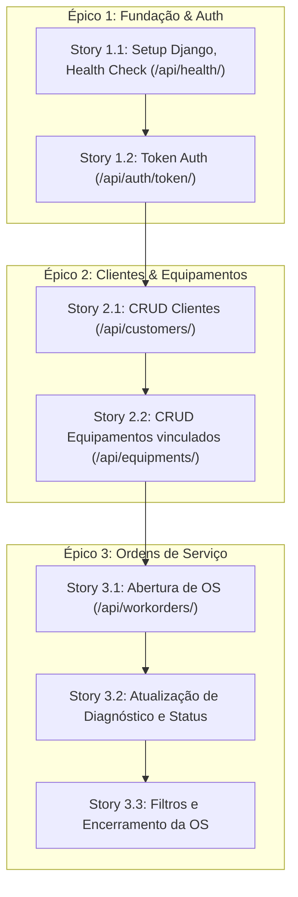

# Avaliação Crítica, Refinamento e Análise Multiperspectiva

**Documento:** Revisão Arquitetural e Análise de Risco  
**Projeto:** TechService API (Django + DRF)  
**Autor:** @architect (Aria)  
**Data:** 22/08/2026  
**Status:** Aprovado para Planejamento de Stories  

---

## 1. Análise Crítica e Refinamentos Arquiteturais

### 1.1 Modelo de Dados e Integridade Relacional
* **Ponto Crítico Identificado:** Abertura de Ordem de Serviço vinculando Equipamento que não pertence ao Cliente informado.
  * **Refinamento:** O serializer de criação da OS (`WorkOrderCreateSerializer`) deve validar explicitamente se `equipment.customer_id == customer.id`. Se houver divergência, retornar HTTP 400 com erro descritivo.
* **Máquina de Estados da OS:**
  * Estados válidos: `recebido` ➔ `em diagnóstico` ➔ `aguardando aprovação` ➔ `em conserto` ➔ `pronto` ➔ `entregue` | `cancelado`.
  * **Refinamento:** Ordens com status terminal (`entregue` ou `cancelado`) não devem permitir novas transições de status.

### 1.2 Estratégia de Autenticação e Segurança
* **Decisão:** Token Authentication padrão do DRF (`rest_framework.authtoken`).
* **Justificativa:** Elimina a complexidade de refresh tokens / rotação de chaves JWT no MVP, permitindo testes rápidos via header `Authorization: Token <key>`.
* **Refinamento:** Usuários inativos (`is_active=False`) devem ter o login bloqueado imediatamente.

---

## 2. Análise de Fluxo e Dependências

### Matriz de Dependência de Entidades:
1. **User (Auth):** Raiz para operações protegidas.
2. **Customer:** Depende de User autenticado.
3. **Equipment:** Depende de Customer existente (`ForeignKey(Customer, on_delete=CASCADE/PROTECT)`).
4. **WorkOrder:** Depende de Customer e Equipment válidos e consistentes entre si.

---

## 3. Avaliação de Alinhamento com o MVP

| Item do Escopo | Status no MVP | Alinhamento com Proposta de Valor |
|---|---|---|
| Autenticação simples (Token) | ✅ Incluído | Essencial para proteger dados dos clientes e demonstrar segurança em API REST. |
| CRUD Clientes & Equipamentos | ✅ Incluído | Base de dados necessária para qualquer assistência técnica. |
| Workflow de Ordem de Serviço | ✅ Incluído | Core business da aplicação (entrada, diagnóstico, orçamento e saída). |
| Notificações WhatsApp/Email | ❌ Fora do MVP | Correto. Adiciona complexidade de provedores externos e filas. |
| Pagamentos & Faturamento | ❌ Fora do MVP | Correto. Regras fiscais e gateways desviariam o foco do portfólio júnior. |
| Multi-tenancy / SaaS | ❌ Fora do MVP | Correto. O MVP foca em uma assistência técnica local de forma simples e robusta. |

---

## 4. Matriz de Identificação e Mitigação de Riscos

| Risco Identificado | Severidade | Impacto | Estratégia de Mitigação |
|---|---|---|---|
| **R1. Inconsistência Cliente x Equipamento na OS** | Alta | Dados corrompidos na assistência | Validação customizada no serializer da WorkOrder garantindo que o aparelho pertence ao cliente informado. |
| **R2. Transição de Status Inválida** | Média | OS entregue sendo reaberta acidentalmente | Regra de validação no Model/Serializer impedindo alteração de status em OS finalizada (`entregue`/`cancelado`). |
| **R3. Orçamento Negativo** | Média | Erro financeiro no registro | Campo `DecimalField` com `MinValueValidator(0)`. |
| **R4. Exposição de Segredos** | Alta | Vazamento de `SECRET_KEY` no GitHub | Uso estrito de `python-decouple` com `.env` e `.env.example`, bloqueado pelo `.gitignore`. |
| **R5. Cascade Delete Acidental** | Alta | Exclusão de cliente apagar histórico de ordens finalizadas | Usar `on_delete=models.PROTECT` em relações de WorkOrder para clientes com histórico ativo. |

---

## 5. Análise Crítica contra Overengineering

1. **Monólito Django vs Microsserviços:** Mantido monólito simples. Zero latência de rede entre serviços, sem necessidade de service discovery ou API Gateway externo.
2. **SQLite vs PostgreSQL em Dev:** SQLite zero-config local. PostgreSQL apenas se houver deploy em nuvem posterior.
3. **Autenticação Token vs OAuth2/Keycloak:** DRF Token nativo atende 100% dos requisitos com 5 linhas de configuração.
4. **Sem Celery/Redis:** Nenhuma tarefa assíncrona foi inventada no MVP.
5. **Estrutura de Apps Coesa:** Projeto dividido em apps enxutos (`core`, `customers`, `workorders`) sem camadas excessivas de indireção desnecessárias.

---

## 6. Avaliação Multiperspectiva de Personas AIOX

### 👔 Perspectiva do PO (Pax)
* *"O PRD resolve a dor real de uma pequena assistência: saber onde está o aparelho do cliente, o que foi diagnosticado e quanto vai custar. O escopo é conciso, comercialmente demonstrável e não se perde em detalhes secundários."*
* **Aprovação:** ✅ **100% Aprovado**.

### 🏃 Perspectiva do SM (River)
* *"A divisão em 3 Épicos e 7 Stories possui granularidade ideal (1 a 2 dias por story). Cada story possui critérios de aceite verificáveis (DoD claro) e dependências lineares fáceis de rastrear em sprints."*
* **Aprovação:** ✅ **100% Aprovado**.

### 💻 Perspectiva do Dev (Dex)
* *"Stack ergonômica, excelente documentação e convenções nativas do Django REST Framework. O uso de ViewSets + Serializers padrões permitirá código limpo, de fácil manutenção e legível para qualquer recrutador ou cliente."*
* **Aprovação:** ✅ **100% Aprovado**.

### 🧪 Perspectiva do QA (Quinn)
* *"Todas as 7 histórias possuem critérios de teste automatizado obrigatórios. A utilização do `APIClient` do DRF permitirá testar 100% dos fluxos de sucesso e falha (400, 401, 403, 404), garantindo qualidade contínua sem depender de testes manuais lentos."*
* **Aprovação:** ✅ **100% Aprovado**.
